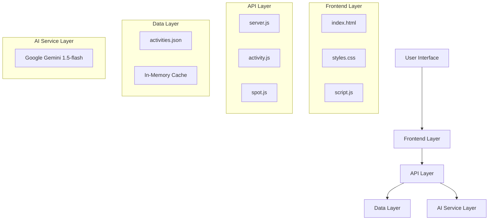

# Almost Liberty - System Architecture

## 🏗️ High-Level Architecture



## 🔄 Request Flow

### Activity Recommendation Flow
1. **User Input**: Location entered via frontend
2. **Data Check**: Search `activities.json` for exact match
3. **Fallback**: If not found, generate via Gemini AI
4. **Response**: Return structured activity categories
5. **Cache**: Store AI results for future requests

### Spot Discovery Flow
1. **User Input**: Location + activity string
2. **Cache Check**: Look for existing results
3. **AI Generation**: Create spot recommendations via Gemini
4. **Parsing**: Extract and validate JSON response
5. **Cache Storage**: Save results for performance
6. **Response**: Return formatted spot list

## 🗂️ Data Architecture

### Primary Data Source: activities.json
```json
{
  "Location Name": {
    "Category 1": ["Activity 1", "Activity 2", ...],
    "Category 2": ["Activity A", "Activity B", ...],
    ...
  }
}
```

### AI Response Format: Activities
```json
{
  "generalActivity1": ["specificActivity1", "specificActivity2"],
  "generalActivity2": ["specificActivity1", "specificActivity2"]
}
```

### AI Response Format: Spots
```json
[
  {
    "relevance": 0,
    "name": "Notes on Location",
    "description": "Search context and notes",
    "features": ["Feature 1", "Feature 2"]
  },
  {
    "relevance": 1,
    "name": "Specific Location",
    "description": "Location description",
    "features": ["Feature A", "Feature B"]
  }
]
```

## 🔧 Technology Stack

### Backend
- **Runtime**: Node.js
- **Framework**: Express.js 4.19.2
- **AI Integration**: @google/generative-ai 0.11.4
- **HTTP Client**: Axios 1.7.2
- **Environment**: dotenv 16.4.5
- **Logging**: Morgan 1.10.0

### Frontend
- **Core**: Vanilla HTML5, CSS3, JavaScript ES6+
- **Styling**: Custom CSS with cosmos theme
- **Assets**: PNG images (background, favicon)
- **Responsive**: Mobile-first design approach

### Infrastructure
- **Deployment**: Vercel (serverless)
- **Configuration**: vercel.json
- **Environment**: Environment variables for API keys

## 🎯 Design Patterns

### 1. Hybrid Data Strategy
- **Pattern**: Predefined data with AI fallback
- **Benefit**: Speed for common requests, flexibility for edge cases
- **Implementation**: Check JSON first, then AI generation

### 2. Caching Layer
- **Pattern**: In-memory object cache
- **Key Format**: `${location}-${activityString}`
- **Benefit**: Reduces AI API calls and improves response time

### 3. Error Handling
- **Pattern**: Try-catch with fallbacks
- **Logging**: Comprehensive console logging
- **User Experience**: Graceful degradation with error messages

### 4. JSON Sanitization
- **Pattern**: Regex extraction + cleanup
- **Purpose**: Handle AI response variations
- **Implementation**: Remove fancy quotes, trailing commas

## 🔒 Security Considerations

### API Key Management
- Stored in environment variables
- Server-side only (not exposed to frontend)
- Process exit if missing

### Input Validation
- Query parameter extraction
- Case-insensitive matching
- JSON parsing with error handling

### Error Information
- No sensitive data in error responses
- Generic error messages to users
- Detailed logging for debugging

## 📊 Performance Optimizations

### Response Times
- JSON lookup: ~1ms (immediate)
- AI generation: ~2-5 seconds (with timing logs)
- Cached responses: ~1ms (immediate)

### Memory Usage
- In-memory cache (grows with usage)
- Static file serving via Express
- Lightweight JSON processing

### Network Efficiency
- Single API calls for complete datasets
- Compressed responses
- Static asset optimization

## 🔄 Scalability Considerations

### Current Limitations
- In-memory cache (lost on restart)
- Single server instance
- No database persistence

### Future Improvements
- Redis cache layer
- Database for user preferences
- Load balancing for multiple instances
- Rate limiting for AI API calls

## 🚀 Deployment Architecture

### Vercel Configuration
```json
{
  "version": 2,
  "builds": [{"src": "server.js", "use": "@vercel/node"}],
  "routes": [{"src": "/(.*)", "dest": "/server.js"}]
}
```

### Environment Variables
- `API_KEY`: Google Gemini API key
- `PORT`: Server port (default: 3000)

### File Structure
```
/
├── server.js           # Main server entry point
├── api/               # API route handlers
├── public/            # Static frontend files
├── activities.json    # Predefined data
├── package.json       # Dependencies
└── vercel.json        # Deployment config
```